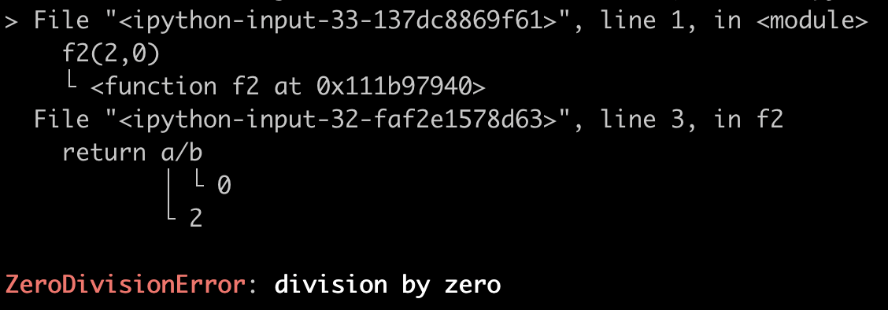

你还在使用`print`来调试代码，记录“日志”？

或者使用`python`的`logging`模块`getLogger`,`setLevel`?

告诉你，都不用，赶紧使用`loguru`来记录日志吧

# 安装

```bash
pip install loguru
```

就是这么简单！

# 快速上手

`loguru`的核心理念是，**你需要且只需要一个`logger`**

## 日志输出API

非常简单易懂

```python
from loguru import logger

logger.debug("Happy logging with Loguru!")
```

`debug`, `warning`,`error`也都一应俱全

```python
logger.debug("Debug message!")
logger.warning("I am warning you!")
logger.error("Ahh, Error occues~")
```

## 定制化

调用`add`方法增加`handler`时可以做定制，比如`colorize`设置为`True`表示输出颜色，而`format`参数代表日志输出的内容格式

```python
import sys

logger.add(sys.stdout, colorize=True, format="<green>{time:YYYY-MM-DD at HH:mm:ss}</green> | <level>{message}</level>")
```

## 日志文件

- `logger.add('log-{time}.log', encoding="utf-8")`会给日志文件名自动增加时间信息以区分，比如`log-2021-03-15_23-36-51_241786.log`，`encoding`参数设置保存为UTF-8编码

- `logger.add('log-{time}.log', rotation="500MB")`会在超过500M时，自动创建新的日志文件

- `logger.add('log-{time}.log', rotation="00:00")`会在每天`00:00`自动创建新的日志文件
- `logger.add('log-{time}.log', compression="zip")`会以zip文件保存日志，节省磁盘空间

这些参数当然可以组合使用，比如

```python
logger.add('log-{time}.log', encoding="utf-8", rotation="00:00", compression="zip")
```

## 字符串format

日志内容的format和`str.format()`用法类似

可以使用最新的`f-string`方式，代替`%`做内容format

```python
person = {'name': 'Alice', 'age': 12}
logger.info(f"info: {person}")
```

## 异常日志捕获

是不是经常忘记写`try...except...`

是不是经常程序出错了，日志中也没有任何上下文记录？

就像下面这个例子

```python
def f1(a, b):
    return a / b
  
f1(1, 0)
```

那么你可以增加一条注解轻松解决

```python
@logger.catch
def f2(a, b):
    return a / b
  

f2(1, 0)
```

遍可以详细地记录日志调用堆栈，以及上下文变量取值。



# 参考

1. https://github.com/Delgan/loguru