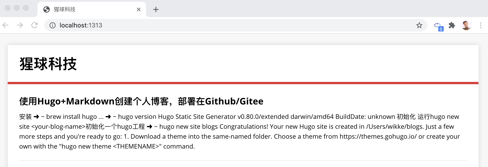

## Hugo介绍

Hugo是用Go语言开发的非常流行的开源静态网站生成器，类似于jekyll，Hexo。

得益于Go语言的优良特性，Hugo运行速度非常快。

今天猩哥带大家体验一遍！

## 安装

```bash
➜  ~ brew install hugo
...

➜  ~ hugo version
Hugo Static Site Generator v0.80.0/extended darwin/amd64 BuildDate: unknown
```

更多操作系统的Hugo安装，参考[https://gohugo.io/getting-started/installing/](https://gohugo.io/getting-started/installing/)

## 初始化站点

运行`hugo new site <your-site-name>`初始化

比如猩哥打算用Hugo来搭建自己的个人博客[https://wikke.gitee.io/](https://wikke.gitee.io/)、[https://wikke.github.io/](https://wikke.github.io/)

```bash
➜  ~ hugo new site blogs
Congratulations! Your new Hugo site is created in /Users/wikke/blogs.

Just a few more steps and you're ready to go:

1. Download a theme into the same-named folder.
   Choose a theme from https://themes.gohugo.io/ or
   create your own with the "hugo new theme <THEMENAME>" command.
2. Perhaps you want to add some content. You can add single files
   with "hugo new <SECTIONNAME>/<FILENAME>.<FORMAT>".
3. Start the built-in live server via "hugo server".

Visit https://gohugo.io/ for quickstart guide and full documentation.
```

进入站点目录，并初始化git仓库

```
➜  cd blogs

➜  blogs git init
Initialized empty Git repository in /Users/wikke/blogs/.git/

```

## 配置站点

### 主题

访问 [https://themes.gohugo.io/](https://themes.gohugo.io/) 挑选一个你喜欢的主题theme。比如我挑选了一个[mainroad](https://themes.gohugo.io/mainroad/)的主题

把它的git项目作为**submoule**添加到<site>/themes目录下

```bash

➜  blogs git:(master) ✗ git submodule add https://github.com/vimux/mainroad themes/mainroad
Cloning into '/Users/wikke/blogs/themes/mainroad'...
remote: Enumerating objects: 4, done.
remote: Counting objects: 100% (4/4), done.
remote: Compressing objects: 100% (4/4), done.
remote: Total 2033 (delta 0), reused 1 (delta 0), pack-reused 2029
Receiving objects: 100% (2033/2033), 1.17 MiB | 1.11 MiB/s, done.
Resolving deltas: 100% (1206/1206), done.
```

### 站点配置

修改`config.toml`配置

- baseURL需要填写github博客的链接，这里`wikke`对应你的Github ID
- title即网站的标题
- theme填写你指定的theme。你可以clone多个theme的submodule，这里选择你想用的那个


## 创建post，即文章/博客

通过Hugo命令创建post，`hugo new posts/blog-with-hugo.md`

- 这里习惯性增加`posts/`前缀，从而组织好目录结构
- 如果你想用markdown来编写内容，则文件后缀为`.md`

然后你就可以使用你喜欢的Markdown编辑器来写博客啦。比如猩哥最喜欢的`Typora`编辑器，完美如图~

（我此刻正在写一篇“如何使用Hugo写博客”的博客，盗梦空间既视感）


## 本地预览

当你完成了markdown博客后，就可以本地预览效果

```bash
➜  blogs git:(master) ✗ hugo server -D
Start building sites …

                   | EN
-------------------+-----
  Pages            | 11
  Paginator pages  |  0
  Non-page files   |  7
  Static files     |  5
  Processed images |  0
  Aliases          |  4
  Sitemaps         |  1
  Cleaned          |  0

Built in 55 ms
Watching for changes in /Users/wikke/blogs/{archetypes,content,data,layouts,static,themes}
Watching for config changes in /Users/wikke/blogs/config.toml
Environment: "development"
Serving pages from memory
Running in Fast Render Mode. For full rebuilds on change: hugo server --disableFastRender
Web Server is available at http://localhost:1313/ (bind address 127.0.0.1)
Press Ctrl+C to stop
```

在`http://localhost:1313/`看效果。上图



>  值得一提的是，如果你的post内容发生了变更，页面会**自动更新**。
>
> 没错，**不需要重新启动服务**，甚至都**不需要手动刷新浏览器!**

## 在线托管

### 生成静态资源

可以通过`hugo help`查看参数

- `--destination`是制定生成静态文件目的地目录。这里之所以设置为docs，是方便和github集成，后面会提到
- `--buildDrafts`表示content/posts中标记为`draft`的post，也会被包括进来生成静态页面
- `--cleanDestinationDir`静态目录中没有的文件，最终也不会出现在destination目录中

```bash
hugo --destination ./docs --buildDrafts --cleanDestinationDir
```

### Gitee Pages

- 创建一个和你用户名一样的repo，比如<>
- 把代码push到远端仓库
- 在repo的服务中点击`Gitee Pages`进入


- 设置部署目录为`/docs`，并强制使用HTTPS（好习惯）


- 点击“启动”，不过几秒钟，就会显示`已开启 Gitee Pages 服务，网站地址： [https://wikke.gitee.io](https://wikke.gitee.io/)`

### Github Pages

- 创建一个`<github-id>.github.io`的repo

- 在`Settings-GitHub Pages`中，选择`master`分支下的`/docs`目录，为未来博客的静态HTLM资源目录


- 上传git仓库到远端master分支
- 过一会儿，你就可以在`<github-id>.github.io`看到你的个人blog啦

##  More

- 你还可以访问[https://github.com/Vimux/Mainroad/](https://github.com/Vimux/Mainroad/)查看更多mainroad主题的配置，比如社交账号，个人信息，主题色定制等等

## Reference

1. [https://gohugo.io/getting-started/quick-start/](https://gohugo.io/getting-started/quick-start/)
2. [https://wikke.gitee.io/](https://wikke.gitee.io/)
3. [https://wikke.github.io/](https://wikke.github.io/)
4. [https://gohugo.io/hosting-and-deployment/hosting-on-github/](https://gohugo.io/hosting-and-deployment/hosting-on-github/)
5. [https://gitee.com/help/articles/4136](https://gitee.com/help/articles/4136)
6. [https://pages.github.com/](https://pages.github.com/)

