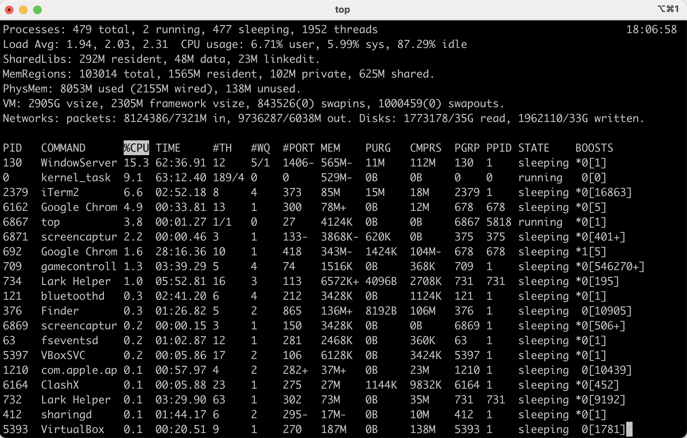
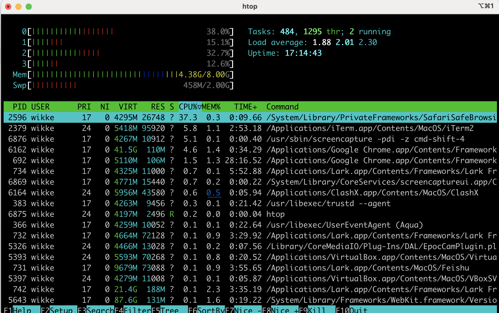
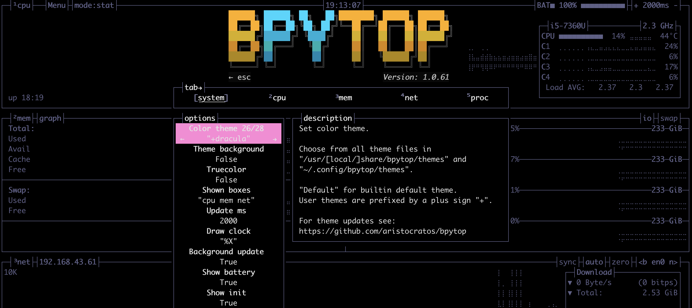
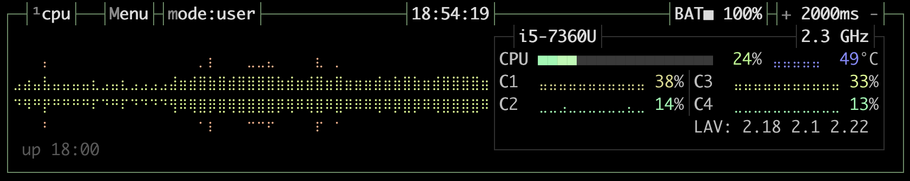
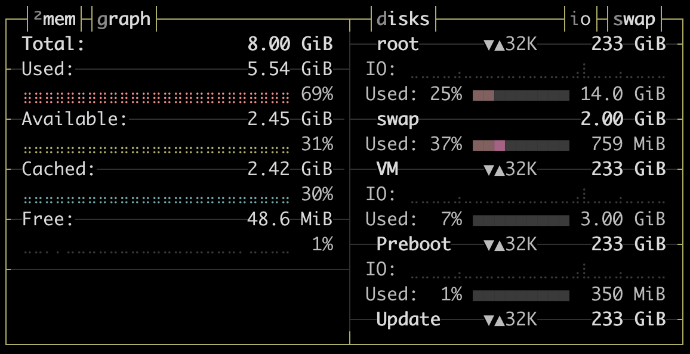
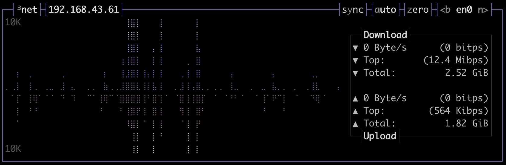
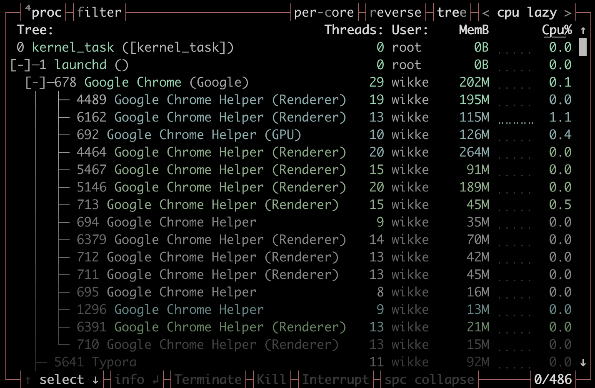

# 俗话说

>  青铜程序员监控主机用`top`



>  黄金程序员监控主机用`htop`



>  王者程序员监控主机用**`bpytop`**



这就是我们今天要介绍的**宇宙第一炫酷无敌游戏风格主机监控工具**：`bpytop`

# 安装

- 如果装有Python3.7及以上运行环境，运行`pip3 install bpytop --upgrade`
- Ubuntu/Debian系统运行`sudo apt install bpytop`

- 如果使用MacOS，运行`brew install bpytop`
- 更多安装方式见官方文档 [https://github.com/aristocratos/bpytop#installation](https://github.com/aristocratos/bpytop#installation)
- Windows? 不好意思，官方文档没有找到！😿

# 运行

直接运行命令即可

```bash
bpytop
```

# 功能

`bpytop`可以监控你主机的`CPU`，`内存/磁盘`，`网络`，以及`进程`

## CPU



- 以`时间轴`的方式展示CPU 运行情况，不得不说这个界面效果，非常炫酷呐
- 右侧展示CPU型号，频率，以及各core的负载和cpu平均负载average load信息

> 据说配置文件里还有修改CPU型号的配置，这个功能你细品，因缺斯汀！

## 内存/磁盘



- 左侧内存部分展示了内存的使用、可用size和比例
- 右侧的磁盘部分展示各文件系统的使用比例和读写负载情况
  - 类似于`df`命令

## 网络



- 默认展示`en0`网卡当前的上行、下行的速率，峰值和总量，并时间轴记录。

## 进程



- 可以输入快捷键`f`来通过关键词过滤进程
- 输入`e`可以切换列表/树状展示
- 鼠标点选或者上下键可以选中进程
  - `回车`可以查看进程详细信息
  - 可以点击**T,K,I**，对选中的进程发送**T**erminate，**K**ill，**I**nterrupt指令

# 主题

- [https://github.com/aristocratos/bpytop/tree/master/themes](https://github.com/aristocratos/bpytop/tree/master/themes)下有非常多开箱即用的主题
- 把repo克隆到本地，然后themes目录复制（更推荐软链接）到`~/.config/bpytop/themes`，然后就可以修改`~/.config/bpytop/bpytop.conf`,改动`color_theme="Default"`为你需要的主题名称，比如`color_theme="monokai"`
- 还有一种更fancy的方式，就是在运行`bpytop`后，点击`ESC`进入`OPTIONS`选项，在`Color theme`中点击左右键切换主题，实时预览主题效果

